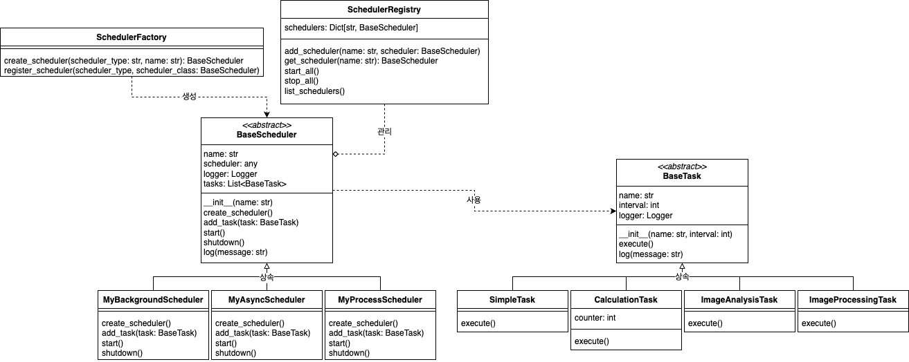

# APScheduler

## 1. 프로젝트 구조
```plain
apscheduler_demo_250514
	├── base
	│   ├── __init__.py
	│   ├── scheduler.py               # 스케줄러 추상 클래스
	│   └── task.py                    # 태스크 추상 클래스
	├── schedulers
	│   ├── __init__.py
	│   ├── background_scheduler.py    # 백그라운드 스케줄러
	│   ├── async_scheduler.py         # 비동기 스케줄러
	│   └── process_scheduler.py       # 프로세스 스케줄러
	├── tasks
	│     ├── __init__.py
	│     ├── simple_task.py           # 단순 태스크
	│     ├── calculation_task.py      # 계산 태스크
	│     ├── image_analysis_task.py   # LLM 이미지 분석 태스크
	│     └── image_processing_task.py # 이미지 처리 태스크
	├── __init__.py
	├── factory.py                     # 스케줄러 팩토리
	├── registry.py                    # 스케줄러 레지스트리
	└── main.py                        # 메인 모듈
```

## 2. 클래스 다이어그램


## 3. 실행 방법
1. 의존성 라이브러리 설치
    ```bash
    pip install apscheduler
    ```
   
2. 실행 명령어
    - Windows
       ```bash
       py3 -m apscheduler_demo_250514.main
       ```
    - Linux
       ```bash
      python3 -m ../apscheduler_demo_250514.main
      ```